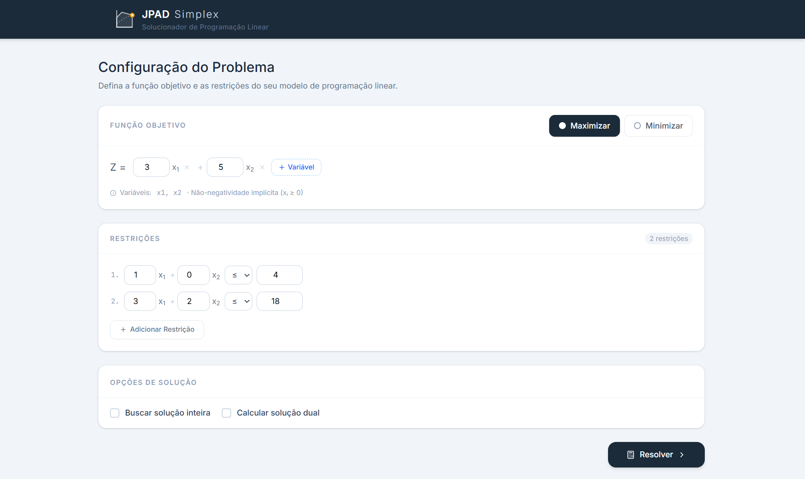

  

# 🚀 JPAD Simplex

**JPAD Simplex** é uma aplicação web desenvolvida para solucionar problemas de Programação Linear utilizando o método Simplex. 
Este projeto foi construído como requisito prático para a disciplina de **Pesquisa Operacional**, parte da grade curricular do curso de **Engenharia de Sistemas** da Unimontes.

## 👥 Equipe Desenvolvedora
* Anna Clara Souza Neri
* Anna Luiza Santos Gusmão
* Davi Atila Silva Souza
* João Vitor Santos Fonseca
* Pedro Henrique Soares Dupin

## 🎯 Objetivos do Projeto
* Aplicar os conceitos teóricos de otimização matemática e Pesquisa Operacional em uma interface interativa.
* Solucionar problemas de Maximização e Minimização.
* Visualizar dados e resultados do algoritmo de forma intuitiva para o usuário.

## ⚙️ Funcionalidades
* Inserção dinâmica de variáveis de decisão e restrições.
* Cálculo automático do quadro (tableau) ótimo.
* Identificação de soluções (múltiplas, ilimitadas ou inviáveis).
* Interface fluida, intuitiva e com feedback em tempo real para o usuário.

## 🛠️ Tecnologias Utilizadas

O projeto adota uma estrutura de repositório único, dividida de forma clara entre Front-end e Back-end em pastas separadas para facilitar a organização e a manutenção do código:

### 💻 Front-end
Desenvolvido com foco em uma interface rica, responsiva e com feedback em tempo real para o usuário:
* **Core & Build:** [React](https://react.dev/) + [Vite](https://vitejs.dev/)
* **Roteamento:** React Router
* **Estilização e Componentes de UI:** 
    * [Tailwind CSS](https://tailwindcss.com/)
    * [Radix UI](https://www.radix-ui.com/)
    * [Material UI (MUI)](https://mui.com/) 
* **Visualização de Dados:** [Recharts](https://recharts.org/) (utilizado para a renderização gráfica parcial dos problemas de otimização)
* **Ícones e Animações:** Lucide React, Framer Motion e Canvas Confetti
* **Gerenciamento de Formulários:** React Hook Form

### ⚙️ Back-end
Responsável pela inteligência do projeto, processamento dos dados e execução core do algoritmo Simplex:
* **Linguagem:** [Python](https://www.python.org/)
* **Bibliotecas & Frameworks:** `[Em desenvolvimento]`

## 💻 Como rodar o projeto localmente

Siga os passos abaixo para executar a aplicação em sua máquina:

1. Clone este repositório:
   ``git clone [https://github.com/seu-usuario/jpad-simplex.git](https://github.com/seu-usuario/jpad-simplex.git)``

### Executando o Front-end

1. Acesse a pasta do front-end:
``
cd frontend
``

2. Instale as dependências e inicie:
``
pnpm install  # ou npm install
npm run dev
``

### Executando o Back-end

1. Acesse a pasta do back-end em um novo terminal:
``
cd backend
``

2. `[Em desenvolvimento]`