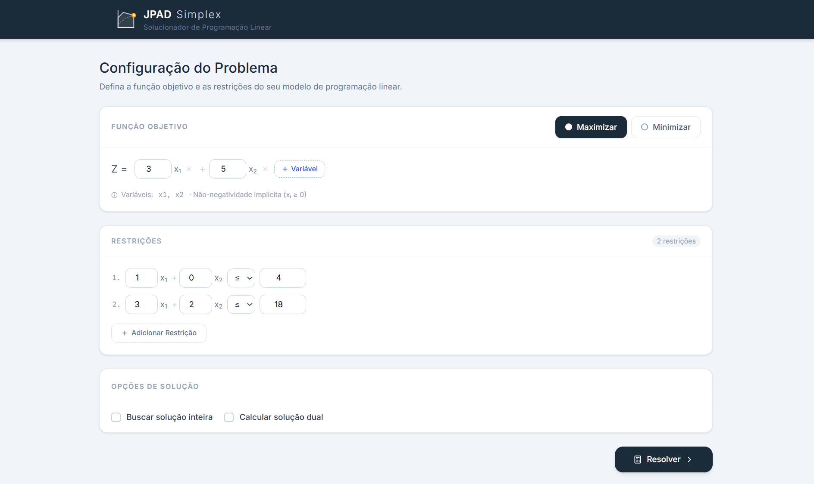

<p align="center">
  
</p>

# 🚀 JPAD Simplex

**JPAD Simplex** é uma aplicação web para resolver problemas de Programação Linear pelo método Simplex, com visualização interativa, análise dual e busca por solução inteira.

Desenvolvido como trabalho final da disciplina de **Pesquisa Operacional** do curso de **Engenharia de Sistemas** da Unimontes, o projeto contempla o requisito principal e **todos os itens de bonificação** propostos pelo professor.

---

## 👥 Equipe Desenvolvedora

* Anna Clara Souza Neri
* Anna Luiza Santos Gusmão
* Davi Atila Silva Souza
* João Vitor Santos Fonseca
* Pedro Henrique Soares Dupin

---

## 🎯 Objetivos

* Aplicar os conceitos de otimização linear em uma ferramenta utilizável.
* Resolver problemas de maximização e minimização com restrições `≤`, `≥` e `=`.
* Identificar e comunicar ao usuário situações especiais: múltiplas soluções, inviabilidade e ilimitação.
* Apresentar o resultado em formato **algébrico (tableau)** e **gráfico**, lado a lado.
* Estender a análise para conceitos avançados: **dualidade** e **programação linear inteira**.

---

## ✨ Funcionalidades

### Requisitos principais

* **Resolução tabular do Simplex** com **método Big-M** para tratar restrições `≥` e `=`.
* **Inserção dinâmica** de variáveis de decisão e restrições na interface.
* Apresentação do **quadro ótimo final** (tableau) com formatação cuidadosa: variáveis de decisão (`xᵢ`), folgas (`Fᵢ`), excessos (`eᵢ`) e termo independente (`b`).
* **Plot da região de viabilidade em 2D** com vértices, retas das restrições, curvas de nível e ponto ótimo destacado.
* **Identificação automática** das situações especiais:
  * **Solução ótima única** → tableau e ponto ótimo no gráfico.
  * **Múltiplas soluções ótimas** → aviso visual em destaque com cada solução alternativa explicitada.
  * **Problema inviável** → mensagem clara explicando que nenhuma combinação satisfaz as restrições.
  * **Problema ilimitado** → mensagem clara explicando que a função objetivo cresce indefinidamente.
* **Caso de aplicação:** problema clássico da radioterapia já validado ponta a ponta.

### Itens de bonificação implementados

| Item | Pontos | Descrição |
| --- | :---: | --- |
| 🎯 **Solução Dual tabular** | +3 | Formulação do dual em notação matemática, valores ótimos das variáveis duais (`y₁, y₂, …`), tableau final do dual e selo "= Z\* primal ✓" verificando a dualidade forte automaticamente. |
| 🎯 **Solução Inteira tabular** | +4 | Algoritmo de **Branch & Bound** com busca best-first, podas por inviabilidade e por limite, tableau do nó vencedor e log completo da exploração (nós explorados, podas, profundidade máxima, histórico de incumbentes). |
| 🎯 **Solução Inteira gráfica** | +3 | Pontos inteiros viáveis e ótimo inteiro plotados sobre a região de viabilidade, com cor distinta (roxo) do ótimo contínuo (âmbar) — evidenciando visualmente a diferença entre PL contínua e PL inteira. |

---

## 🛠️ Tecnologias

O repositório é um monorepo, com pastas separadas para **front-end** e **back-end**.

### 💻 Front-end
Interface rica, responsiva e com feedback em tempo real para o usuário:
* **Core & Build:** [React](https://react.dev/) + [Vite](https://vitejs.dev/) + TypeScript
* **Roteamento:** React Router
* **Estilização e componentes de UI:** [Tailwind CSS](https://tailwindcss.com/), [Radix UI](https://www.radix-ui.com/), [Material UI](https://mui.com/)
* **Visualização do gráfico de viabilidade:** SVG nativo (sem dependência adicional)
* **Ícones e animações:** Lucide React, Motion, Canvas Confetti
* **Formulários:** React Hook Form

### ⚙️ Back-end
Inteligência matemática e camada HTTP:
* **Linguagem:** [Python](https://www.python.org/) 3.10+
* **API & Servidor HTTP:** [Flask](https://flask.palletsprojects.com/) + [Flask-CORS](https://flask-cors.readthedocs.io/)
* **Cálculo matricial:** [NumPy](https://numpy.org/)
* **Visualização local (opcional):** [matplotlib](https://matplotlib.org/) — usado por scripts de desenvolvimento

---

## 📁 Estrutura do projeto

```
jpad-simplex-develop/
├── backend/
│   ├── simplex.py              # Motor Simplex (forma tabular + Big-M)
│   ├── dual.py                 # Construção e resolução do problema dual
│   ├── branch_and_bound.py     # B&B para solução inteira
│   ├── api.py                  # Camada Flask: rotas /health e /solve
│   ├── radiotherapy_example.py # Caso clássico de validação
│   ├── graficos.py             # Visualização local com matplotlib (dev)
│   ├── teste_grafico.py        # Script de teste no terminal (dev)
│   ├── requirements.txt
│   └── README_BACKEND.md       # Documentação técnica do back-end
├── frontend/
│   └── src/app/
│       ├── pages/              # InputPage e ResultsPage
│       ├── components/         # FeasibilityChart e demais
│       ├── utils/              # api.ts, solver.ts (geometria + pontos inteiros)
│       └── types.ts            # SimplexResult, DualResult, IntegerResult
├── API.md                      # Documentação completa da API HTTP
├── ALTERACOES.md               # Registro técnico das alterações
└── README.md                   # Este arquivo
```

---

## 💻 Como executar localmente

### Pré-requisitos

* **Python 3.10+** com `pip`
* **Node.js 18+** com `npm` (ou `pnpm`)

### Back-end

```bash
cd backend
pip install -r requirements.txt
python api.py
```

A API sobe em `http://localhost:5000`. Verifique com:

```bash
curl http://localhost:5000/health
# {"service":"jpad-simplex-api","status":"ok"}
```

### Front-end

Em outro terminal:

```bash
cd frontend
npm install
npm run dev
```

A interface abre em `http://localhost:5173` e já aponta para a API em `localhost:5000`.

> ⚠️ Suba **primeiro** o back-end. Sem ele, o front-end exibe a mensagem "Não foi possível conectar ao servidor de cálculo".

---

## 🧪 Roteiro rápido de demonstração

Para ver todos os recursos em ação, no formulário da interface:

1. Mantenha o problema padrão (radioterapia) ou monte o seu.
2. Marque **"Buscar Solução Inteira"** e **"Calcular Dual"**.
3. Clique em **Resolver**.

A tela de resultados terá quatro abas:

* **Tableau Simplex (Primal)** — quadro ótimo do problema original.
* **Solução Gráfica** — região viável, ponto ótimo contínuo e (se solicitado) ponto ótimo inteiro com pontos inteiros viáveis.
* **Tableau Dual** — formulação do dual + tableau + dualidade forte verificada.
* **Solução Inteira** — algoritmo B&B com Z\* inteiro, gap em relação ao contínuo, tableau do nó vencedor e log da árvore.

---

## 📚 Documentação adicional

* **[`API.md`](./API.md)** — arquitetura completa da API: fluxo de dados, schema das requisições/respostas e detalhes de cada função.
* **[`ALTERACOES.md`](./ALTERACOES.md)** — registro técnico das alterações feitas em cada etapa do trabalho (integração back-end ↔ front-end, correção de bug no Big-M).
* **[`backend/README_BACKEND.md`](./backend/README_BACKEND.md)** — detalhes técnicos do motor Simplex, dos módulos auxiliares (dual, B&B) e dos scripts de validação local.
